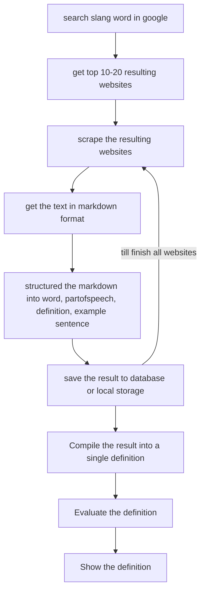

```mermaid
flowchart TD;
    A[search slang word in google]-->B[get top 10-20 resulting websites];
    B-->C[scrape the resulting websites];
    C-->D[get the text in markdown format];
    D-->E[structured the markdown into word, partofspeech, definition, example sentence];
    E-->F[save the result to database or local storage]-->|till finish all websites| C;
    F-->G[Compile the result into a single definition];
    G-->H[Evaluate the definition];
    H-->K[Show the definition];
```